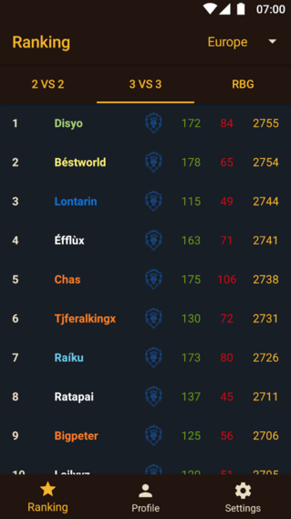

# WoWArena
Open source World of Warcraft Arena Ranking application.
**WowArena uses the old Battle Net API. It not work properly until it have been migrated to the new API.**

The application have been developed using:
- Flux architecture based on [Mini library](https://github.com/pabloogc/Mini).
- Retrofit for communicate with the Battle net API.
- Dagger 2 for dependency injection.
- Firebase for the custom database, Analytics, Crashlytics and Firebase Performance.
- Google Cloud functions to fetch the Battle net API and update Firebase database.
- Moshi for work with JSON

      

You can download the app on [Google Play](https://play.google.com/store/apps/details?id=durdinstudios.wowarena):
